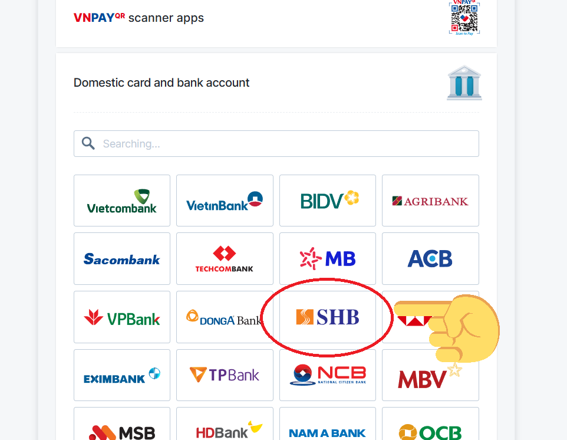

# Anko Watch - Web Application

Anko Watch is a web application developed using **Flask** for the backend and **MongoDB** for data storage. The app integrates **VNPAY** for payment processing, similar to **Paypal**.

## Features

### Admin Functions:
- **Manage Products (CRUD)**: Admin can create, read, update, and delete products in the system.
- **Manage Members**: Admin can manage users' accounts and their roles.
- **Manage Payments**: Admin can handle payment records and status.
- **Manage Promotions**: Admin can create and manage promotional offers.
- **Manage News**: Admin can add, update, or delete news articles.
- **Manage Orders**: Admin can view and manage all customer orders.
- **Revenue Statistics**: Admin can view, track revenue statistics and export as .csv file.

### User Functions:
- **View Products**: Users can browse through all the products available in the system.
- **Search Products**: Users can search for products by name, category, or other filters.
- **Manage Shopping Cart**: Users can add, update, or remove items from their shopping cart.
- **Read News**: Users can read news articles published on the platform.
- **Manage Personal Information (CRUD)**: Users can create, update, or delete their personal information.
- **Make Payments**: Users can proceed to make payments for their orders.
- **Track Orders**: Users can track the status of their orders in real-time.

## Upcoming Features:
- **Chatbot for Customer Support**: A chatbot feature for assisting users with common inquiries and customer service.
- **Visa Payment Integration**: Users will be able to make purchases using Visa card payment options.

## Installation

1. Clone the repository:
   ```bash
   git clone https://github.com/PhongNgh/AnkoWatch-Ecommerce.git


2. Install required dependencies:
   ```bash
   pip install -r requirements.txt

3. Set up MongoDB and VNPAY integration following the instructions in the setup guide.
   
4. Run the application:
      ```bash
    python app.py

5. Access the application on http://localhost:5000.

## Technologies Used
**Backend**: Flask  
**Database**: MongoDB  
**Payment Integration**: VNPAY  
**Frontend**: HTML, CSS, JavaScript, Bootstrap  
**Caching**: Redis  
**Image Storage**: Cloudinary  
**Alert Effect**: SweetAlert2

## If you use VNPAY method for payment
You can use a test account provided by VNPAY official

1. Click "Domestic card and bank account, choose NCB" like this 

2. Enter this card information 
   ```bash
   **Card number**: 9704198526191432198
   **Card Holder**: NGUYEN VAN A
   **Issuing date**: 07/15
   **OTP**: 123456
## Update 23/05/2025

You can test all function in this project with this link 👉 https://anko-watch-ecommerce-phongngh-test-a643722c.vercel.app/